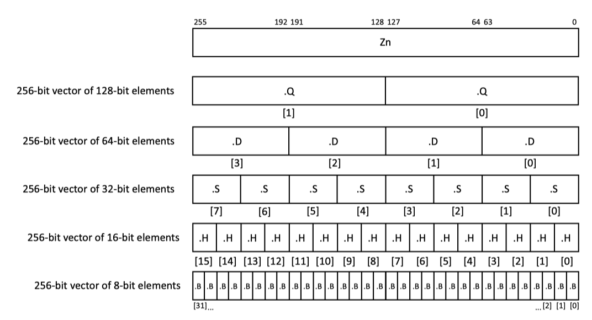

# Registers

### Vector Registers

There are 32 scalable vector registers, `z0 ~ z31`

* Each of their length is a multiple of 128 bits with minimum 128 bits and maximum 2048 bits.
* Each vector can be divided by several elements with 128 bits \(.Q\), 64 bits\(.D\), 32 bits \(.S\), 16 bits\(.H\), or even 8 bits\(.B\).
* The element size is encoded in the opcode.
* The `[127:0]` of `z0 ~ z31` are shared with the SIMD&FP registers, `V0 to V31` in AArch64

### Predict Registers

* Each one byte \(eight bits\) of the vector registers have their own one-bit predict register; therefore, the length of the predict registers is one-eighth of the size of the vector register.
* Predict register length is a multiple of 16
* They can be subdivided into 1 bit, 2 bits, 4 bits, or 8 bits.
* For all instruction except those listed in Predicate Permute, the last bit in each element of the predict register is focused. The other bits will be ignored and set to zero on writes.
* If the last bit is 1, the predict element if `TRUE`; if it is 0, then the predict element is `FALSE`

